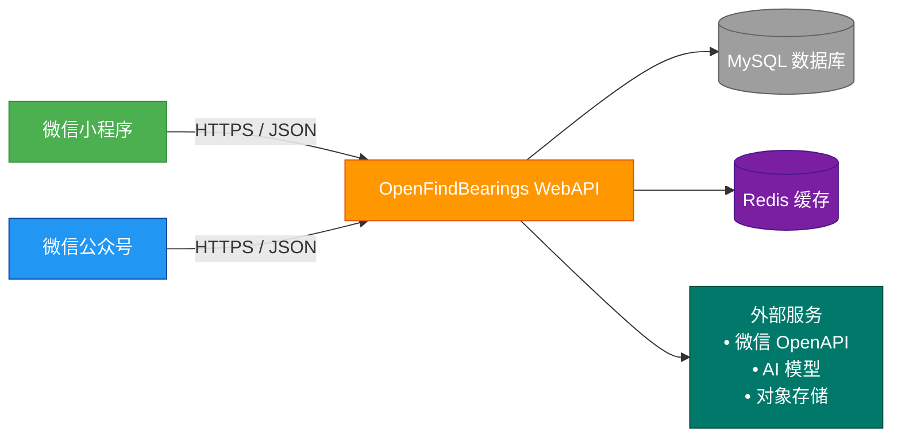

# OpenFindBearings - 让轴承交易更简单
利用AI和大数据，让找货、询价、匹配变得像“刷抖音”一样简单，你就是轴承


# 🏗️ OpenFindBearings 系统架构

### 🏗️ 一、 整体架构设计：前后端分离

这种架构的核心原则是：**后端只负责数据，前端只负责展示，两者通过 `JSON` 格式通信。**



* **前端（微信端）：** 负责用户界面、交互（滑动、点击）、调用摄像头（拍图识货）。
* **后端（WebAPI）：** 负责处理业务逻辑（发布消息、搜索型号）、数据校验、安全认证。
* **通信协议：** 必须使用 `HTTPS`，数据格式统一为 `JSON`。

---

### 🧩 二、 前端设计：微信生态的差异化利用

微信的三个产品（小程序、服务号、企业号）分工明确：

#### 1. 微信小程序

​**核心应用**

* **功能定位：** 交互最复杂、体验要求最高的地方。
* **关键页面：**
  * 发现页（滑动匹配）：实现你之前说的“左滑感兴趣，右滑不感兴趣”的功能。
  * 发布页：支持拍照上传轴承图片、语音输入型号。
  * 搜索页：强大的轴承型号模糊搜索（防呆设计，防止输错字母）。
  * 聊天页：买卖双方的即时沟通。

#### 2. 微信公众号（服务号/订阅号）

**消息触达中心**

* **功能定位：** 用户唤醒、消息通知。
* **玩法：**
  * **服务号：** 用于发送模板消息。例如：“您发布的求购单有新报价了！”、“您的订单已发货”。
  * **订阅号：** 用于发布行业资讯和​价格行情，维持用户粘性。

#### 3. 企业微信（可选，进阶用）

* **功能定位：** 预留未来内部团队管理（比如地推团队、客服团队），用企业微信来管理供应商的认证和审核。

---

### ⚙️ 三、 后端设计：WebAPI 的核心模块

**核心模块**

#### 1. API 接口规范（一定要规范！）

**建议采用** RESTful风格，这样代码好维护，也方便以后对接其他系统。

* **通用格式：**
  
  ```json
  {
    "code": 200,       // 状态码：200成功，401未授权，500错误
    "msg": "操作成功",  // 提示信息
    "data": {}         // 具体的数据内容
  }
  ```
* **版本控制：** URL 中带上版本号，例如 `https://api.xxx.com/v1/goods/list`。这样以后接口升级（V2.0）不会影响老用户。

#### 2. 核心功能模块划分

**表格**

| 模块           | 功能点            | 技术要点                                                           |
| ---------------- | ------------------------ | ------------------------------------------------------- |
| 用户认证 | 登录/注册/身份认证 | WT Token机制。利用微信的 `openid` **作为用户的唯一ID，免去用户名密码记忆。   |
| 消息中心 | 发布求购/供应信息  | 支持图文混排。后端要对敏感词进行过滤。                                      |
| 搜索服务 | 型号搜索/模糊匹配  | Elasticsearch（搜索引擎）。轴承型号多且容易输错（如O/0混淆），必须支持纠错搜索。|
| 推荐引擎 | 滑动匹配/猜你喜欢  | 基于用户行为的推荐算法（协同过滤）。                                         |
| 交易系统 | 下单/支付/订单查询 | 事务处理。涉及金额，必须保证数据一致性（下单减库存要锁机制）。                 |

---

### 🔐 四、 关键流程设计（以“发布供求”为例）

1. **前端（小程序）：**
   * 用户填写：型号（6201）、数量、期望价格、备注。
   * 用户点击“发布”按钮。
2. **前端 -> 后端：**
   * 发起** `POST` 请求到 `https://api.xxx.com/v1/demand/publish`。
   * 请求头带上** `Token`（证明是谁发的）。
   * 请求体带上刚才填的数据。**
3. **后端（WebAPI）：**
   * 校验：检查 Token 是否过期，检查数据是否合法（比如数量是不是负数）。
   * 处理：把这条消息存入数据库（MySQL 或 MongoDB）。
   * 返回：返回 `{"code": 200, "msg": "发布成功"}`。
4. **前端：**
   * 收到成功提示，跳转回列表页，刷新数据。

---

### 🚀 五、 针对“轴承”行业的特殊技术建议

1. **型号标准化（数据清洗）：**
   * 用户输入的型号五花八门（“6201”、“6201 zz”、“6201-2RS”）。后端 API 必须有一个​“型号清洗”​的接口，自动把它们归类到标准型号下，否则数据全是乱的。
2. **图片识别（AI赋能）：**
   * 在小程序端集成**拍照识图**​。用户拍个轴承照片，后端 API 调用 AI 接口识别型号。极大体验提升。
3. **防爬虫与数据安全：**
   * 供求数据是核心资产。后端要设置频率限制（Rate Limiting），防止竞争对手写个脚本把数据全爬走。

---

其他请参阅 [系统架构](docs/architecture.md) 获取详细内容。

# 🤝 贡献指南

## 1. 开发环境设置
1. 安装 .NET 10 SDK
2. 安装 Docker Desktop
4. 安装 Mysql 8.0
5. 配置开发证书
## 2. 代码规范
- 遵循 C# 编码规范
- 使用 EditorConfig 统一格式
- 编写单元测试和集成测试
- API 文档与代码同步更新
## 3. 提交规范
- 使用 Conventional Commits
- 关联 Issue 编号
- 提供详细的变更说明
- 通过 CI 测试和代码审查

---

**版本**: 1.0.0  
**技术栈**: .NET 10 + mysql 8 + Dapr  
**维护者**: abcsxl  
**许可证**: MIT